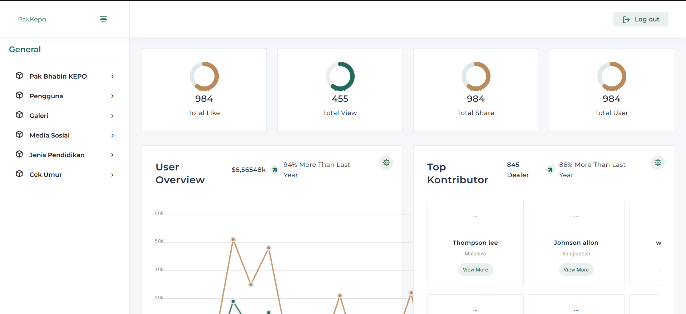

# Pakepo Backend



## Getting Started

<i>PA'KEPO</i> adalah aplikasi informasi pendaftaran polisi yang dibangun melalui kerja sama Polisi Daerah Sumatera Selatan dengan Universitas Bina Darma.

## Table of Contents

- [Pakepo Backend](#pakepo-backend)
  - [Getting Started](#getting-started)
  - [Table of Contents](#table-of-contents)
  - [Prerequisite](#prerequisite)
  - [Tech/Library Used](#techlibrary-used)
  - [Installation](#installation)
    - [1. Clone the project :](#1-clone-the-project-)
    - [2. Install package](#2-install-package)
    - [4. Run the app](#4-run-the-app)
  - [User Otentikasi](#user-otentikasi)

## Prerequisite

- PHP ^8.0.2

## Tech/Library Used

- Laravel ^9.19

## Installation

### 1. Clone the project :

```bash
git clone https://github.com/SISKA-UBD/pakepo_backend
```

### 2. Install package

jalankan <i>command</i> berikut untuk instal kebutuhan aplikasi

```javascript
composer install
```

<b>NOTE:</b> jika di <i>production</i>, instalasi kebutuhan aplikasi menggunakan

```javascript
composer install --optimize-autoloader --no-dev
```

jalankan <i>artisan command</i> untuk eksekusi database dan user

```javascript
php artisan migrate --seed
```

### 4. Run the app

```bash
php artisan serve
```

## User Otentikasi

```javascript
email:
superadmin@gmail.com
admin@gmail.com

password: password
```

<br>
<br>
<br>
Regards, <br>
Direktorat Sistem & Teknologi Informasi Universitas Bina Darma
